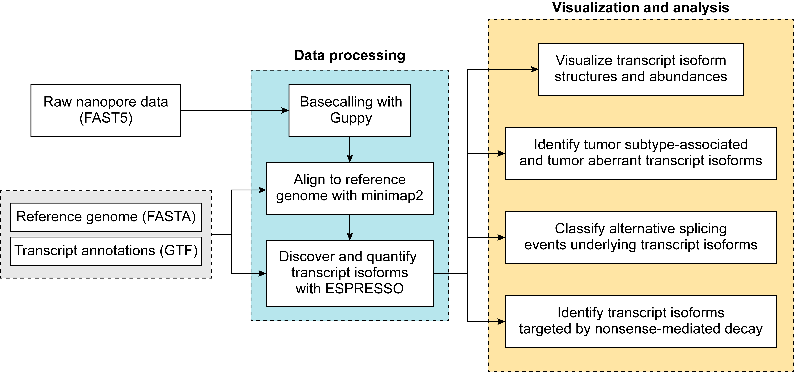
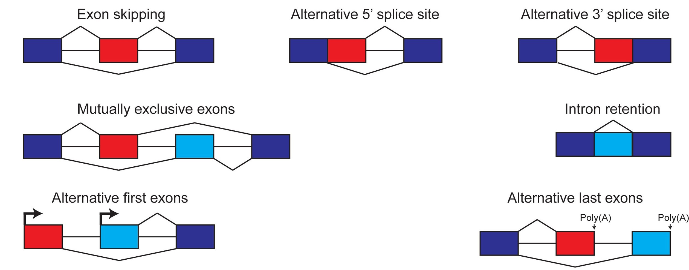

# TEQUILA-seq: Data Analysis Software

The scripts contained in this repository were used for processing, analyzing, and visualizing TEQUILA-seq data.

## Table of Contents

- [TEQUILA-seq: Data Analysis Software](#tequila-seq-data-analysis-software)
  - [Table of Contents](#table-of-contents)
  - [Overview](#overview)
  - [Dependencies](#dependencies)
  - [Usage](#usage)
    - [Data processing](#data-processing)
    - [Data visualization and analysis](#data-visualization-and-analysis)
      - [Transcript isoform visualization](#transcript-isoform-visualization)
      - [Identification of tumor subtype-associated transcript isoforms](#identification-of-tumor-subtype-associated-transcript-isoforms)
      - [Identification of tumor aberrant transcript isoforms](#identification-of-tumor-aberrant-transcript-isoforms)
      - [Classification of alternative splicing events underlying discovered transcript isoforms](#classification-of-alternative-splicing-events-underlying-discovered-transcript-isoforms)
      - [Identification of NMD-targeted transcript isoforms](#identification-of-nmd-targeted-transcript-isoforms)


## Overview



Our data processing scripts are designed to work with raw nanopore data (FAST5 format) as input. However, these scripts can work with data from any long-read sequencing platform (e.g., PacBio) as long as the data is provided in FASTQ/SAM/BAM format. These scripts encompass the following steps:
1. **Basecalling**: Raw nanopore data (FAST5 format) is basecalled into nucleotide sequences (FASTQ format) using Guppy in fast mode.
2. **Alignment**: Basecalled reads are mapped to a user-supplied reference genome using [minimap2](https://github.com/lh3/minimap2) (Li H., *Bioinformatics* 2018) together with user-supplied reference transcript annotations.
3. **Transcript isoform discovery and quantification**: Full-length transcript isoforms are discovered and quantified from long-read alignment files using [ESPRESSO](https://github.com/Xinglab/espresso).

We also wrote scripts for visualizing and analyzing transcript isoforms discovered from TEQUILA-seq data. These scripts were designed to perform the following tasks:
1. **Visualize discovered transcript isoforms**: Given a collection of samples subjected to TEQUILA-seq, visualize the structures and relative abundances of all transcript isoforms discovered for a given gene.
2. **Identify tumor subtype-associated and tumor aberrant transcript isoforms**: Using TEQUILA-seq data generated on a panel of 40 breast cancer cell lines (2 replicates for each of the 40 breast cancer cell lines), each representing 4 distinct intrinsic subtypes (luminal, HER2 enriched, basal A, basal B), identify transcript isoforms with significantly elevated proportions in cell lines belonging to a given subtype versus all other cell lines (i.e., tumor subtype-associated transcript isoforms). For the same dataset, identify transcript isoforms with significantly elevated proportions in at least one but no more than 4 breast cancer cell lines (i.e., tumor aberrant transcript isoforms).  
3. **Classify alternative splicing events underlying discovered transcript isoforms**: Local differences in transcript structure between any two transcript isoforms are classified into different alternative splicing categories, including exon skipping, alternative 5' splice site, alternative 3' splice site, mutually exclusive exons, intron retention, alternative first exon, alternative last exon, and complex splicing. 
4. **Identify NMD-targeted transcript isoforms**: Transcript isoforms that may be targeted by nonsense-mediated mRNA decay (NMD) are identified from the set of transcript isoforms discovered from TEQUILA-seq data based on multiple layers of criteria (e.g., transcript length, number of splice junctions, the 50 nt rule). 


## Dependencies

To run our scripts, the following dependencies will need to be installed and available on `$PATH`:

* [Snakemake](https://snakemake.readthedocs.io) (v5.31.1) 
* Guppy (must be downloaded manually from the [ONT software download page](https://community.nanoporetech.com/downloads) since a login is required)
* [minimap2](https://github.com/lh3/minimap2) (v2.17)
* [SAMtools](http://samtools.sourceforge.net) (v1.9)
* [BLAST](https://www.ncbi.nlm.nih.gov/blast/) (v2.10.1)
* [HMMER](http://hmmer.org/) (v3.3.1)
* [UCSC KentUtils](http://hgdownload.soe.ucsc.edu/admin/exe/)
  + bedGraphToBigWig
  + faToTwoBit
  + twoBitInfo
* [Python](https://www.python.org/) 3.8
  + [NumPy](https://numpy.org/) (v1.20.1)
  + [pandas](https://pandas.pydata.org/) (v1.1.4)
  + [SciPy](https://scipy.org/) (v1.5.4)
  + [statsmodels](https://www.statsmodels.org/) (v0.12.2)
  + [NetworkX](https://networkx.org/) (v2.6.3)
  + [BeautifulSoup4](https://pypi.org/project/beautifulsoup4/) (v4.8.2)
  + [ConfigArgParse](https://pypi.org/project/ConfigArgParse/)
* [R](https://www.r-project.org/) (v4.0.5)
  + [ggplot2](https://ggplot2.tidyverse.org/)
  + [tidyverse](https://www.tidyverse.org/)
  + [ggplotify](https://cran.r-project.org/package=ggplotify)
  + [scales](https://scales.r-lib.org/)
  + [forcats](https://forcats.tidyverse.org/)
* [Perl](https://www.perl.org/) (v5.26.2) built with threading enabled
  + Check for thread support with `perl -e 'use threads; print("ok\n")'`

The source code for ESPRESSO (v1.2.2), which is another dependency, is available in the folder [ESPRESSO_alpha1.2.2](./ESPRESSO_alpha1.2.2/). For details on memory requirements (i.e., as a function of input data size and number of threads), please refer to the [ESPRESSO GitHub page](https://github.com/Xinglab/espresso).


## Usage

### Data processing

A Snakemake workflow is provided for running the data processing scripts. The workflow can start from raw nanopore data (FAST5 format), sequencing reads data (FASTQ format), or long-read alignment data (SAM/BAM format). **Note:** A different configuration will be required depending on what type of data you are starting with. The workflow can also be configured to run multiple samples and each sample can have multiple inputs. Set the configuration by editing the [snakemake_config.yaml](./snakemake_config.yaml) and [snakemake_profile/config.yaml](./snakemake_profile/config.yaml) files. 

Prior to running the data processing scripts, please make sure that [conda](https://conda.io/) is installed. Then, `./install` can be run to install all dependencies required for data processing (except Guppy, which requires a manual installation). Specifically, `./install` will create a conda environment with the required dependencies and set some absolute file paths in [snakemake_config.yaml](./snakemake_config.yaml)

Details on configuring the [snakemake_config.yaml](./snakemake_config.yaml) file are as follows:

* Set the amount of resources to allocate for each task as follows:
  + `{job_name}_threads: {num_threads}`
  + `{job_name}_mem_gb: {num_GBs}`
  + `{job_name}_time_hr: {num_hours}`
* Specify the path to the folder containing the ESPRESSO source code as follows:
  + `espresso_path: /path/to/ESPRESSO/src`
* If starting with raw nanopore data, specify the path to the `bin` folder containing Guppy as follows:
  + `guppy_bin_path: /path/to/guppy/bin/`
* Specify the reference genome sequence (FASTA format) and reference transcript annotations (GTF format) to be used:
  + You can provide download URLs for these files as follows:
    + `gtf_url: 'protocol://url/for/some_file.gtf.gz'`
    + `gtf_name: 'some_file.gtf'`
    + `fasta_url: 'protocol://url/for/some_file.fasta.gz'`
    + `fasta_name: 'some_file.fasta'`
  + You can also place these files in the [references](./references) folder and just set the `gtf_name` and `fasta_name` fields. (Use '' for `gtf_url` and `fasta_url`)
* For each input sample, create a corresponding config entry as follows:
  + For samples with raw nanopore data (FAST5 format), please provide the Guppy config file and the directory of FAST5 files as follows:
    + `guppy_config: 'the_guppy.cfg'`
    + `fast5_dir: '/path/to/fast5/dir'`
  + For samples with sequencing reads data (FASTQ format), please provide the appropriate file path as follows:
    + `fastq: '/path/to/the.fastq'`
  + For samples with long-read alignment data (SAM/BAM format), please provide **one** of the following fields as appropriate:
    + `sam: '/path/to/the.sam'`
    + `bam: '/path/to/the.bam'`
* Lastly, the following config values can be set to `true` or `false` as appropriate:
  + `use_annotated_junctions_with_minimap2`: Uses splice junctions recorded in the user-provided GTF as input to `minimap2`
  + `keep_espresso_c_temp`: Keep temporary files generated by the `C` step of `ESPRESSO`
  + `output_compatible_isoforms`: Generate a file (named `samples_N2_R0_compatible_isoform.tsv`) that maps long read IDs to their compatible transcript isoforms
  + `enable_visualization`: Generates files for visualizing transcript isoforms discovered by ESPRESSO. This requires setting other config values under "Visualization options" (**Note:** We recommend setting `enable_visualization` to false as we have separate scripts in this repository dedicated to generating visualizations for discovered transcript isoforms).

Edit the files in the folder [snakemake_profile](./snakemake_profile) to configure how jobs should be run in a cluster environment as follows:
* [config.yaml](./snakemake_profile/config.yaml): Sets various Snakemake parameters, such as whether jobs should be submitted to a cluster.
* [cluster_submit.py](./snakemake_profile/cluster_submit.py): Script to submit jobs.
* [cluster_status.py](./snakemake_profile/cluster_status.py): Script to check job status.
* [cluster_commands.py](./snakemake_profile/cluster_commands.py): Script to run commands specific to the cluster management system being used. The default implementation is for Slurm, but other cluster environments can be used by changing this file. For example, [cluster_commands_sge.py](./snakemake_profile/cluster_commands_sge.py) can be used if working with an SGE cluster.

For reference, examples of pre-configured `snakemake_config.yaml` files can be found in the folder [Config_for_each_system](./Config_for_each_system). Once the `snakemake_config.yaml` file has been appropriately configured, the Snakemake workflow can be run with `./run`

Upon completion, the following files will be generated in the folder `espresso_out/work_dir`:
* `samples_N2_R0_abundance.esp`: a tab-delimited file describing the expression levels of discovered transcript isoforms across input samples
  + Each discovered transcript isoform is reported on a separate line.
  + The first three columns are: `transcript_ID`, `transcript_name`, and `gene_ID`. Additional columns correspond to input samples and show the number of reads from a given sample that were counted towards each transcript isoform.
  + Transcript isoform read counts are assigned by expectation maximization, such that each read contributes at most 1 count, either to a single transcript isoform or distributed as fractional counts to multiple transcript isoforms.
* `samples_N2_R0_updated.gtf`: a transcript annotation file (GTF format) describing the coordinates of all discovered transcript isoforms
  + The `source` column indicates whether each transcript isoform is a `novel_isoform` or an `annotated_isoform`
* `samples_N2_R0_compatible_isoform.tsv`: an optional tab-delimited file that describes compatible transcript isoforms for each read in a given sample
  + The columns are `read_id`, `sample_name`, `read_classification`, and `compatible_isoforms`. Possible classifications for each read under the column `read_classification` include:
    + **Full Splice Match (FSM)**: indicates that the read carries a combination of splice junctions that is consistent with that of a known transcript isoform
    + **Incomplete Splice Match (ISM)**: indicates that the read carries a combination of splice junctions that is part of a known transcript isoform
    + **Novel In Catalog/Novel Not in Catalog (NIC/NNC)**: indicates that the read carries at least one splice junction involving a novel combination of known splice sites or novel splice sites, respectively.
    + **Not Completely Determined (NCD)**: indicates that the read carries at least one splice junction that could not be corrected by ESPRESSO
    + **Single-exon**: indicates that the read does not carry any splice junctions

The Snakemake workflow will also produce log files that are named after the rules contained in the [Snakefile](./Snakefile). Specifically, there will be `{rule_name}_log.out` and `{rule_name}_log.err` files containing the stdout and stderr, respectively, of the command run for that rule. There will also be `.cluster.out`, `.cluster.err`, and `.cluster.usage` files if a rule was submitted to the cluster using [cluster_submit.py](./snakemake_profile/cluster_submit.py).


### Data visualization and analysis

After data processing, we used the following scripts to visualize and analyze the transcript isoforms discovered from our samples. 


#### Transcript isoform visualization

We wrote scripts, [1_Data_process.sh](./scripts/1_Data_process.sh) and [2_Figure_generation.sh](./scripts/2_Figure_generation.sh), that can generate the following types of plots:
1. Stacked barplots showing (a) estimated abundances and (b) isoform proportions of transcript isoforms discovered for a user-specified gene from a collection of samples subjected to TEQUILA-seq
2. Diagrams showing the structures of transcript isoforms discovered for a user-specified gene from a collection of samples subjected to TEQUILA-seq

Our visualization script requires a file containing reference transcript annotations (GTF format), and this file should be placed in the [files](./scripts/scripts/files/) folder. If you are using the GRCh37/hg19 reference genome build, we recommend downloading and using this [transcript annotation file](https://ftp.ebi.ac.uk/pub/databases/gencode/Gencode_human/release_34/GRCh37_mapping/gencode.v34lift37.annotation.gtf.gz). Alternatively, if you are using the GRCh38/hg38 reference genome build, we recommend downloading and using this [transcript annotation file](https://ftp.ebi.ac.uk/pub/databases/gencode/Gencode_human/release_39/gencode.v39.annotation.gtf.gz).

To demonstrate how to run our visualization script, we have provided a test dataset in the folder [Example_res](./scripts/BRCA_Example/). The files that will be generated after running [1_Data_process.sh](./scripts/1_Data_process.sh) include:
* **samples_BedGraph.bed**: A BED file that was directly converted from `samples_N2_R0_updated.gtf`, the transcript annotation file generated by ESPRESSO (GTF format). 
  * This BED file contains exon-level coordinates for each transcript isoform discovered from input samples.
* **samples_N2_R0_abundance_CPM_ESPRESSO_gene.txt**: a tab-delimited file describing the expression levels (in counts per million, CPM) for discovered transcript isoforms of target genes across input samples. 
  * This file was directly generated from `samples_N2_R0_abundance.esp` (an output file generated by ESPRESSO) by normalizing transcript isoform read counts for each input sample to CPM. 
  * The first three columns are: `transcript_ID`, `transcript_name`, and `gene_ID`. Additional columns correspond to input samples and show the CPM values of transcript isoforms discovered in a given sample.
* **samples_N2_R0_abundance_CPM_ESPRESSO_proportion_reshaped_merge_others.txt**: a tab-delimited file with six columns where each row corresponds to an individual transcript isoform of a target gene that was discovered in a given input sample. 
  * Each row has the following pieces of information:
    * Gene ID
    * Transcript ID
    * Input sample ID
    * Transcript isoform proportion in the given input sample
    * Tumor subtype associated with the given input sample
    * Hexadecimal color code associated with the tumor subtype
  * The top five transcript isoforms of a given target gene with the highest average transcript isoform proportion across all samples are represented individually, while remaining transcript isoforms are grouped together into an "Others" category.  
* **samples_N2_R0_abundance_CPM_ESPRESSO_reshaped_merge_others.txt**: a tab-delimited file with six columns where each row corresponds to an individual transcript isoform of a target gene that was discovered in a given input sample. 
  * Each row has the following pieces of information:
    * Gene ID
    * Transcript ID
    * Input sample ID
    * CPM of the transcript isoform in the given input sample
    * Tumor subtype associated with the given input sample
    * Hexadecimal color code associated with the tumor subtype
  * The top five transcript isoforms of a given target gene with the highest average transcript isoform proportion across all samples are represented individually, while remaining transcript isoforms are grouped together into an "Others" category (to match the isoforms shown in the **samples_N2_R0_abundance_CPM_ESPRESSO_proportion_reshaped_merge_others.txt** file).  

Given a target gene of interest, as well as a transcript isoform of interest, we can run our script `Template_to_generate_figures.sh` (which will be generated by [2_Figure_generation.sh](./scripts/2_Figure_generation.sh)).

For example, we can use [Template_to_generate_figures.sh](./scripts/Template_to_generate_figures.sh) to visualize (a) transcript isoforms of *TP53* and (b) transcript isoforms of *DNMT3B* that were discovered from TEQUILA-seq data generated on our panel of 40 breast cancer cell lines (2 replicates for each of the 40 breast cancer cell lines):

Plots generated by our script (in both PNG and PDF format) can be found in the folder [Example_res](./scripts/BRCA_Example/Example_res/).


#### Identification of tumor subtype-associated transcript isoforms

We wrote a script, [SubtypeSpecificIsoforms.py](./scripts/SubtypeSpecificIsoforms.py), to identify tumor subtype-associated transcript isoforms from TEQUILA-seq data generated on our panel of 40 breast cancer cell lines (2 replicates for each of the 40 breast cancer cell lines), each representing 4 distinct intrinsic subtypes (luminal, HER2 enriched, basal A, basal B). Tumor subtype-associated transcript isoforms have significantly elevated proportions in cell lines belonging to a given subtype versus all other cell lines. Our script uses the following approach to identify tumor subtype-associated transcript isoforms:
* For each subtype, run a two-sided Student's *t*-test to compare the proportion of a transcript isoform between cell lines belonging to the given subtype and all other cell lines.
* Filter for transcript isoforms meeting the following criteria:
  * FDR-adjusted *p*-value from two-sided Student's *t*-test is $\leq$ a user-defined threshold
  * The difference between the mean transcript isoform proportion across cell lines of the given subtype and the mean transcript isoform proportion over all other cell lines is $\geq$ a user-defined threshold

The following input files are required for running our script:
* A tab-delimited file containing isoform proportions for discovered transcript isoforms across input samples. 
  * This file can be directly generated from `samples_N2_R0_abundance.esp` (an output file generated by ESPRESSO) by dividing the read count of a transcript isoform by the total read count for the corresponding gene (i.e., sum of read counts over all transcript isoforms discovered for the gene) for each input sample. 
  * The first three columns are: `transcript_ID`, `transcript_name`, and `gene_ID`. 
  * Additional columns correspond to input samples and show the proportion of the transcript isoform in a given sample. 
  * Please refer to the file [samples_N2_R0_abundance_proportion_target_genes.txt](./scripts/Example_res/samples_N2_R0_abundance_proportion_target_genes.txt) as an example. 
* A tab-delimited file mapping each input sample ID to a tumor subtype. 
  * Each row represents an input sample and has three columns: (i) a sample ID, (ii) a cell line ID, and (iii) a tumor subtype. 
  * Please refer to the file [BRCA_cell_lines.txt](./files/BRCA_cell_lines.txt) as an example.

Detailed usage information for our script is shown below:

```
python SubtypeSpecificIsoforms.py [-h] -i /path/to/isoform/proportion/matrix -a /path/to/sample-subtype_match_table -t <number of worker threads> \
    -c <FDR threshold> -d <delta_proportion threshold> -o /path/to/output/file

script arguments:
    -h, --help                                          show this message and exit

    -i /path/to/isoform_proportion_matrix               tab-delimited file containing isoform proportions for discovered transcript isoforms
                                                        across input samples

    -a /path/to/sample-subtype_match_table              tab-delimited file containing mapping information between indiviudal samples and
                                                        their respective tumor subtypes

    -t <number of worker threads>                       number of worker threads (integer)

    -c <FDR threshold>                                  FDR threshold for calling transcript isoforms as tumor subtype-associated
                                                        (float between 0 and 1)

    -d <delta_proportion threshold>                     threshold on the difference (in %) between the mean transcript isoform proportion across cell lines 
                                                        of a given subtype and the mean transcript isoform proportion over all other cell lines 
                                                        (float between 0 and 100)

    -o /path/to/output/file                             path to output tsv file summarizing all transcript
                                                        isoforms prioritized as being tumor subtype-associated
```

Our script will generate a tsv file summarizing all transcript isoforms prioritized as being tumor subtype-associated based on user-specified thresholds. Each line of the tsv file has the following output fields:

* **Field 1**: Gene symbol corresponding to the gene of a tumor subtype-associated transcript isoform
* **Field 2**: Transcript ID of the tumor subtype-associated transcript isoform
* **Field 3**: Gene ID corresponding to the gene of a tumor subtype-associated transcript isoform
* **Field 4**: Corresponding tumor subtype
* **Field 5**: Average transcript isoform proportion across cell lines of the specified tumor subtype
* **Field 6**: Raw *p*-value for tumor subtype-association
* **Field 7**: FDR-adjusted *p*-value for tumor subtype-association
* **Field 8**: Indicator for whether the transcript isoform is tumor subtype-associated


#### Identification of tumor aberrant transcript isoforms

We wrote a script, [SampleSpecificIsoforms.py](./scripts/SampleSpecificIsoforms.py), to identify transcript isoforms that are present at significantly elevated proportions in a single cell line replicate based on TEQUILA-seq data generated on our panel of 40 breast cancer cell lines (2 replicates for each of the 40 breast cancer cell lines) (hereafter referred to as "sample-specific" transcript isoforms). Briefly, our script uses the following approach to identify sample-specific transcript isoforms:
1. For each gene, generate an *m*-by-80 matrix comprised of read counts (rounded to the nearest integer) for *m* discovered transcript isoforms across 80 TEQUILA-seq samples (2 replicates for each of the 40 breast cancer cell lines).
2. Run a chi-square test of homogeneity (FDR $\lt$ user-specified threshold) on the matrix to assess whether transcript isoform proportions for the given gene are homogenous across all samples.
3. Focusing on genes identified by the chi-square test as having an FDR-adjusted *p*-value $\lt$ user-specified threshold, run a post-hoc one-tailed binomial test (FDR $\lt$ user-specified threshold) to identify sample-isoform pairs in which the transcript isoform proportion in the given sample is significantly higher than the overall transcript isoform proportion over all samples (i.e., sum of read counts of the transcript isoform over all samples divided by the sum of read counts of the gene over all samples)
  
Detailed usage information for our script is shown below:

```
python SampleSpecificIsoforms.py [-h] -i /path/to/ESPRESSO/isoform/abundance/matrix -t <number of worker threads> \
    -c <FDR threshold> -o /path/to/output/file

script arguments:
    -h, --help                                          show this message and exit

    -i /path/to/ESPRESSO/isoform/abundance/matrix       path to tsv file generated by ESPRESSO summarizing all discovered transcript 
                                                        isoforms across samples and their assigned read counts

    -t <number of worker threads>                       number of worker threads (integer)

    -c <FDR threshold>                                  FDR threshold for calling transcript isoforms as sample-specific 
                                                        (float between 0 and 1)

    -o /path/to/output/file                             path to output tsv file summarizing all transcript isoforms 
                                                        prioritized as being sample-specific
```

Our script will generate a tsv file summarizing all transcript isoforms prioritized as being sample-specific at the specified FDR threshold. Each line of the tsv file has the following output fields:

* **Field 1**: Gene ID corresponding to the gene of a sample-specific transcript isoform
* **Field 2**: Transcript ID of the sample-specific transcript isoform
* **Field 3**: Name of the corresponding sample
* **Field 4**: Read counts assigned by ESPRESSO to the sample-specific transcript isoform in the given sample
* **Field 5**: Overall transcript isoform proportion
* **Field 6**: Transcript isoform proportion in the given sample
* **Field 7**: Raw *p*-value for sample-specificity
* **Field 8**: FDR-adjusted *p*-value for sample-specificity

To identify tumor aberrant transcript isoforms, we took the set of sample-specific transcript isoforms reported by our script and first identified cell line-isoform pairs for which the transcript isoform showed significantly elevated usage in a given cell line. Specifically, these pairs were required to meet the following criteria:
* The transcript isoform has an FDR-adjusted *p*-value $\lt$ 1% (post-hoc test) for both replicates of the given cell line
* The transcript isoform proportions in both replicates are $\geq$ 10% higher than the overall transcript isoform proportion over all samples. 

Finally, tumor aberrant transcript isoforms are identified based on the following criteria:
1. The transcript isoform shows significantly elevated usage in at least 1 but no more than 4 cell lines (i.e., $\leq$ 10% of our breast cancer cell line panel)
2. The transcript isoform is not the canonical transcript isoform of the corresponding gene, as defined by the [Ensembl database (Release 100, April 2020)](http://apr2020.archive.ensembl.org/index.html). 


#### Classification of alternative splicing events underlying discovered transcript isoforms

We wrote a script, [FindAltTSEvents.py](./scripts/FindAltTSEvents.py), that compares the structures of any two transcript isoforms. Local differences in transcript structure are then classified into 7 basic alternative splicing categories:



* Exon skipping (SE)
* Alternative 5'-splice site (A5SS)
* Alternative 3'-splice site (A3SS)
* Mutually exclusive exons (MXE)
* Intron retention (RI)
* Alternative first exon (AFE)
* Alternative last exon (ALE)

Any local differences in transcript structure that could not be classified as one of the 7 basic alternative splicing categories were classified as "complex" (COMPLEX). **Note:** It is possible to have combinations of alternative splicing events for any given pair of transcript isoforms.

Detailed usage information for our script is shown below:

```
python FindAltTSEvents.py [-h] -i /path/to/input/GTF -o /path/to/output/file

script arguments:
    -h, --help                                          show this message and exit

    -i /path/to/input/GTF                               path to GTF file containing annotations for two transcript isoforms

    -o /path/to/output/file                             path to output file
```

Our script will subsequently generate a tab-delimited file consisting of four fields:
* **Field 1**: ID for transcript isoform 1
* **Field 2**: ID for transcript isoform 2
* **Field 3**: Discovered alternative splicing events
* **Field 4**: Genomic coordinates for alternative splicing events

**Note:** Designation of transcript isoforms 1 and 2 is completely arbitrary. Moreover, if the two transcript isoforms contained in the input GTF file exhibit a combination of multiple alternative splicing events, each event will be reported as its own line in the output file.


#### Identification of NMD-targeted transcript isoforms

To identify NMD-targeted transcript isoforms, we first retrieved the sequences of discovered transcript isoforms (from a user-supplied reference genome) and searched for open reading frames (ORFs). For discovered transcript isoforms that are annotated as `'basic' protein-coding` in reference transcript annotations, we used the annotated ORF. Alternatively, for other transcript isoforms, we used the longest ORF and required it to encode at least 20 amino acids. Among transcripts with predicted ORFs, we identified those that may be NMD-targeted using the following criteria (adapted from [Lindeboom et al., *Nat. Genet* (2016)](https://www.nature.com/articles/ng.3664)):
1. The transcript is $\geq$ 200 nt long
2. The transcript contains at least one splice junction
3. **The 50 nt rule:** The predicted stop codon is $\geq$ 50 nt upstream of the last splice junction (i.e., the transcript harbors a premature termination codon).

We wrote a script, [Translation.sh](./scripts/Translation.sh), that searches for ORFs from transcripts contained in an input file of transcript annotations (GTF format). Our script requires (i) a user-supplied reference genome (FASTA format) and (ii) user-supplied reference transcript annotations (GTF format). Prior to running our script, these files should be placed in the [files](./scripts/scripts/files/) folder. If you are using the GRCh37/hg19 reference genome build, we recommend using [this reference genome file](https://ftp.ebi.ac.uk/pub/databases/gencode/Gencode_human/release_34/GRCh37_mapping/GRCh37.primary_assembly.genome.fa.gz) and [this transcript annotation file](https://ftp.ebi.ac.uk/pub/databases/gencode/Gencode_human/release_34/GRCh37_mapping/gencode.v34lift37.annotation.gtf.gz). Alternatively, if you are using the GRCh38/hg38 reference genome build, we recommend using [this reference genome file](https://ftp.ebi.ac.uk/pub/databases/gencode/Gencode_human/release_39/GRCh38.p13.genome.fa.gz) and [this transcript annotation file](https://ftp.ebi.ac.uk/pub/databases/gencode/Gencode_human/release_39/gencode.v39.annotation.gtf.gz). 

Detailed usage information for our script is shown below:

```
python scripts/Translation.py \
--mode long-read \
--trans_gtf /path/to/ESPRESSO/gtf/file \
--isoform_cpm_inf /path/to/isoform_cpm_matrix \
--genome_version hg19 \
--ref_gtf /path/to/reference/gencode/gtf/file \
--out_file /prefix/of/name/of/output/file \
--outf_dir /path/to/folder/of/output/file

script arguments:
    -h, --help                                          Show this message and exit

    --mode                                              Long-read or short-read RNA-seq data mode, default is long-read

    --trans_gtf                                         Generated ESPRESSO gtf file

    --isoform_cpm_inf                                   Generated isoform CPM abundance file

    --genome_version                                    Choose from ['GRCH38','GRCH37','hg38','hg19']

    --ref_gtf                                           Reference gencode annotation gtf

    --out_file                                          Prefix of the name of output file

    --outf_dir                                          Folder of output 

```

Our script will generate protein FASTA files for both protein-coding transcript isoforms and NMD-targeted transcript isoforms in the user-specified output directory.

